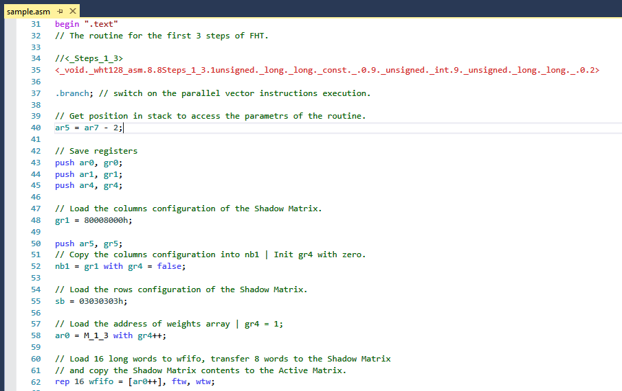
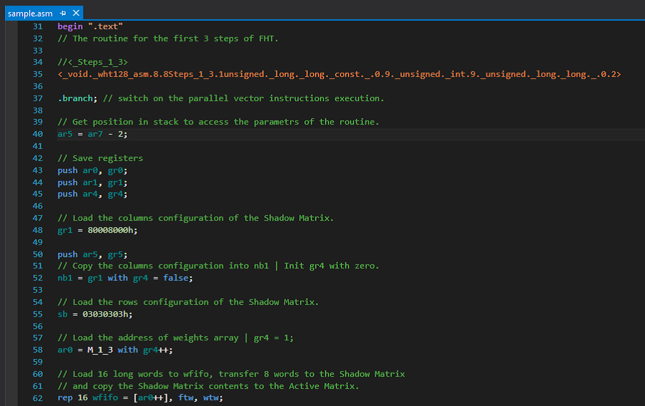

NM_asm_Highlight
======

Подсветка кода ассемблера NeuroMatrix для Visual Studio 2013 (кроме Express) и Visual Studio 2015

Ссылка в галерее Visual Studio: [NeuroMatrix assembly language](https://visualstudiogallery.msdn.microsoft.com/ca93d385-b301-4f64-85e9-fa924d8304ab)
___
# Блоки

- [x] Подсветка синтаксиса
- [x] Сворачивание комментариев
- [x] IntelliSense
	- [x] Statement completion
	- [x] QuickInfo (Словарь в процессе наполнения)
	
___
# Установка:

Скачать и запустить файл [NM_asm_Highlight.vsix](export/NM_asm_Highlight.vsix).  
После скачивания возможно автоматическое получение обновлений через Visual Studio Gallery.

___
# Планы на разработку:

- [x] Добавить поддержку VS 2013
- [x] Реализовать сворачивание комментариев
- [x] Разместить в https://visualstudiogallery.msdn.microsoft.com/
- [ ] Реализовать анализ и сворачивание тегов
- [ ] Разместить в в https://github.com/RC-MODULE/ в качестве официальной утилиты
- [ ] Осуществлять смену цветовой гаммы подсветки синтаксиса без перезапуска VS
	
___
# Пример подсветки для светлой темы:	

___
# Пример подсветки для тёмной темы:	

